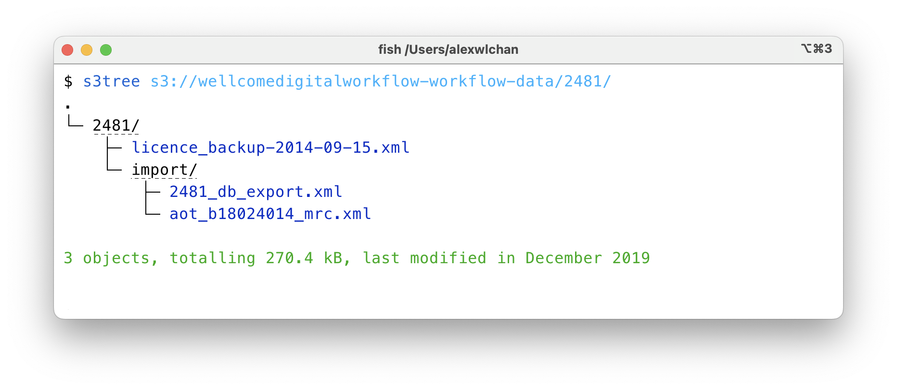
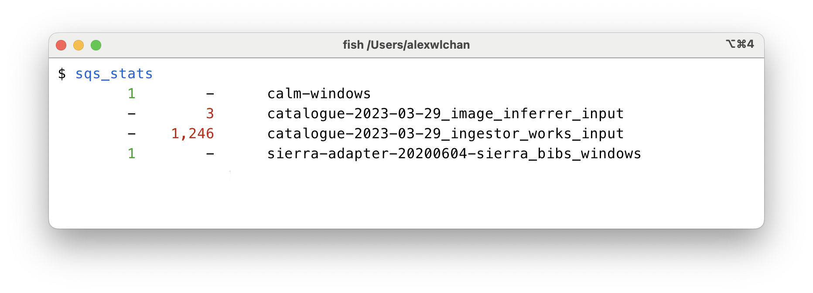

# aws

These are scripts to do stuff in AWS.

## The individual scripts

<dl>
  <dt>
    <a href="https://github.com/alexwlchan/scripts/blob/main/aws/aws"><code>aws</code></a>
  </dt>
  <dd>
    a wrapper around the AWS CLI that ensures I have fresh credentials (see below)
  </dd>

  <dt>
    <a href="https://github.com/alexwlchan/scripts/blob/main/aws/bulk_sns_publish"><code>bulk_sns_publish</code></a>
  </dt>
  <dd>
    a tool for publishing lots of messages to SNS, using the <code>PublishBatch</code> API.
    See <a href="https://alexwlchan.net/2023/my-sns-firehose/">Publishing lots and lots of messages to SNS</a>.
  </dd>

  <dt>
    <a href="https://github.com/alexwlchan/scripts/blob/main/aws/download_sqs_messages"><code>download_sqs_messages</code></a>
  </dt>
  <dd>
    a tool for downloading lots of messages from SQS, using the <code>ReceiveMessage</code> API.
    See <a href="https://alexwlchan.net/2018/downloading-sqs-queues/">Getting every message in an SQS queue</a>.
  </dd>

  <dt>
    <a href="https://github.com/alexwlchan/scripts/blob/main/aws/dynamols"><code>dynamols</code></a>
  </dt>
  <dd>
    print the items in a DynamoDB table, one item per line
  </dd>

  <dt>
    <a href="https://github.com/alexwlchan/scripts/blob/main/aws/s3_unfreeze"><code>s3_unfreeze</code></a>
  </dt>
  <dd>
    takes a list of S3 URIs as input, and either restores those objects from Glacier or reports the status of an in-progress restoration
  </dd>

  <dt>
    <a href="https://github.com/alexwlchan/scripts/blob/main/aws/s3hash"><code>s3hash <S3_URI> [--algorithm=<ALGO>]</code></a>
  </dt>
  <dd>
    get the checksum/hash of an object in S3
  </dd>

  <dt>
    <a href="https://github.com/alexwlchan/scripts/blob/main/aws/s3ls"><code>s3ls</code></a>
  </dt>
  <dd>
    list objects from an S3 prefix using the <code>ListObjectsV2</code> API, and print them as JSON to stdout.
    
<pre><code>$ s3ls s3://wellcomedigitalworkflow-workflow-data
{"Key": "10009/import/10009_db_export.xml", "LastModified": "2019-12-17T15:11:45+00:00", "ETag": "\"dd51824d2f7f434eba02b84a3ad2d2e0\"", "Size": 36883, "StorageClass": "STANDARD"}
{"Key": "10009/import/pp_cri_h_5_20_box_91_b18181272_mrc.xml", "LastModified": "2019-09-06T15:17:56+00:00", "ETag": "\"51899c7af2f78bee7a9ee79f358e5b67\"", "Size": 3462, "StorageClass": "STANDARD"}
{"Key": "10009/taskmanager/2013-09-17_15-54-03_1625/pp_cri_h_5_20_box_91_b18181272_jpg_1378258257168.xml", "LastModified": "2019-09-06T15:18:01+00:00", "ETag": "\"f71d4745ad32863008e158463cdc0bd3\"", "Size": 8279, "StorageClass": "STANDARD"}
…</code></pre>

    I typically dump the results of this to a file before doing any processing – listing objects from S3 is moderately slow.
  </dd>

  <dt>
    <a href="https://github.com/alexwlchan/scripts/blob/main/aws/s3rm"><code>s3rm</code></a>
  </dt>
  <dd>
    delete objects from an S3 prefix.
    To see a preview of what objects this will delete, use the <code>s3ls</code> script – they use the same code to list objects.
  </dd>

  <dt>
    <a href="https://github.com/alexwlchan/scripts/blob/main/aws/s3tree"><code>s3tree</code></a>
  </dt>
  <dd>
    show a tree-like view of objects and folders in an S3 prefix.
    It includes clickable links to folders in the S3 console, so I can dig into the objects in more detail.
    
  </dd>

  <dt>
    <a href="https://github.com/alexwlchan/scripts/blob/main/aws/sqs_stats"><code>sqs_stats</code></a>
  </dt>
  <dd>
    prints a summary of messages visible on our SQS queues.
    The two columns (which are green/red) show messages visible on the main queue and dead-letter queue respectively.
    
  </dd>
</dl>

## Guessing the right account

Some of the scripts require me to explicitly pick an IAM profile or account; others will guess based on the resource I'm looking at.

*   The `sqs_stats` script looks at all the SQS queues in an account, so I need to tell it which account to look at.

*   The `download_sqs_messages` script looks at an individual queue, and takes a queue URL as argument.
    SQS queue URLs include the account ID, so it can pick a suitable IAM role for that account.

## _ensure_aws_credentials_are_fresh

At Wellcome, we don't have permanent AWS credentials on our local machines – instead, we use [aws-azure-login] to get short-lived credentials that last a few hours.
This is meant to reduce the risk profile of lost secrets; e.g. if a laptop is stolen, it's less likely to have useful AWS credentials than if we all had long-lived, permanent credentials.
(See our [platform-infrastructure docs][pi-docs].)

It's moderately frustrating to run a command, be told "your credentials have expired, go get some new ones", and have to do that before running the same command again – so the `_ensure_aws_credentials_are_fresh` does that freshness check for me.

If it detects my AWS credentials are out-of-date, it proactively fetches a new set of credentials and then runs the original command I was trying to run.
This makes everything run a little smoother.

I never invoke this script directly, but it is invoked by a bunch of my other tools to get this nice behaviour.

[aws-azure-login]: https://github.com/aws-azure-login/aws-azure-login
[pi-docs]: https://github.com/wellcomecollection/platform-infrastructure/blob/main/accounts/docs/cli-credentials.md
