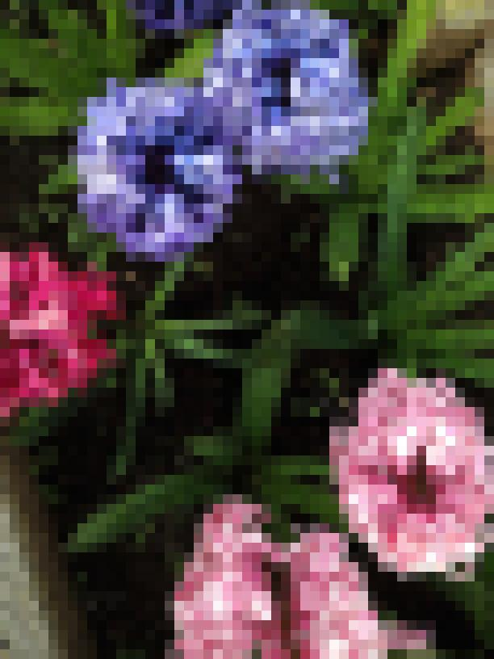
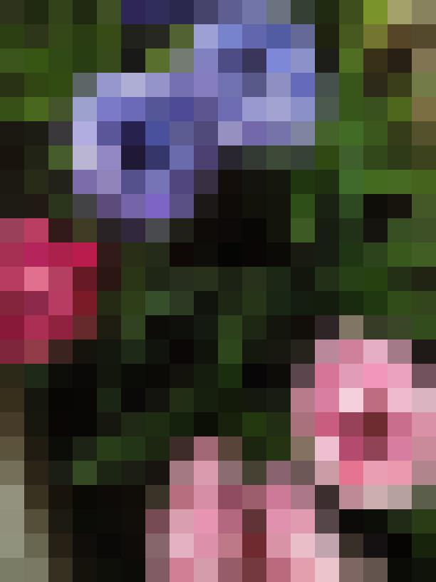
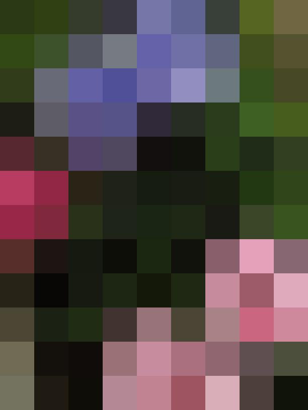
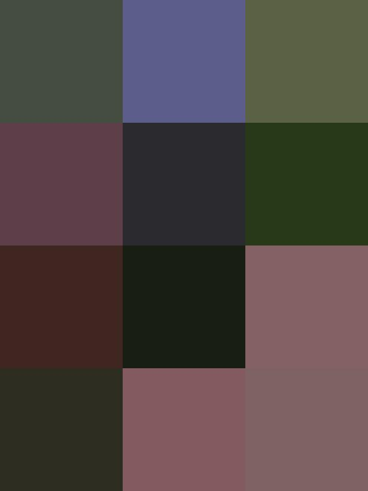
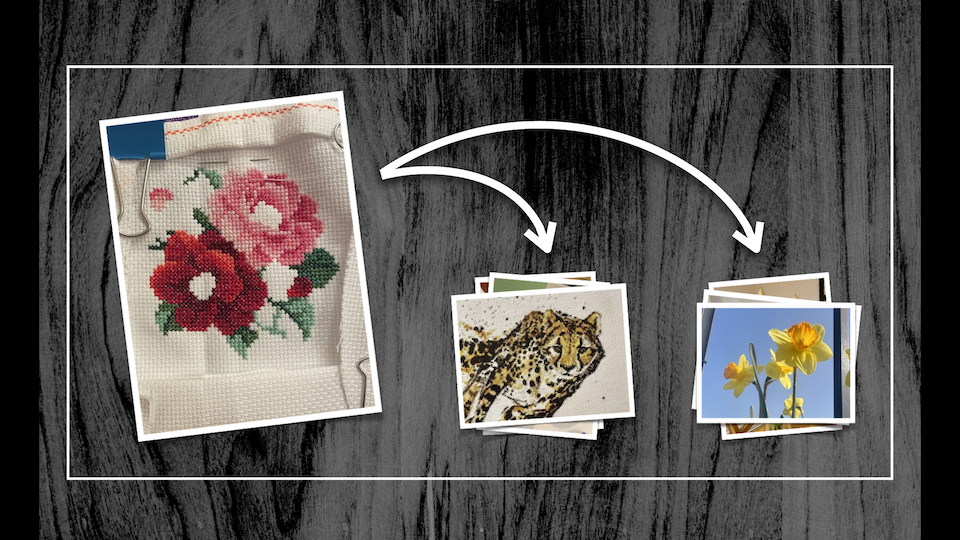
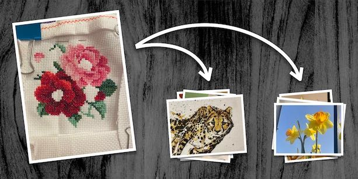
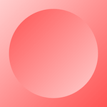

# images

These scripts are for working with images and other visual material.

## The individual scripts

<dl>
  <dt>
    <a href="https://github.com/alexwlchan/scripts/blob/main/images/chunky_pixels">
      <code>chunky_pixels [PATH] [PIXEL_SIZE]</code>
    </a>
  </dt>
  <dd>
    redraw an image using “chunky” pixels – that is, replacing every NxN block of pixels with a single colour.
    

      <table>
        <tr>
          <td>
            
            original
          </td>
          <td>
            
            N=12
          </td>
          <td>
            
            N=34
          </td>
          <td>
            
            N=68
          </td>
          <td>
            
            N=204
          </td>
        </tr>
      </table>
    

  </dd>

  <dt>
    <a href="https://github.com/alexwlchan/scripts/blob/main/images/copycrop">
      <code>copycrop</code>
    </a>
  </dt>
  <dd>
    this script will “copy” the crop from one image pair to another.
    
For example, suppose I have a full-screen screenshot and a crop to a small region of the screen:

    

      <table>
        <tr>
          <td></td>
          <td>&amp;</td>
          <td></td>
        </tr>
      </table>
    

    I can use this tool to extract the equivalent region from a second screenshot:
    

      <table>
        <tr>
          <td></td>
          <td>&rarr;</td>
          <td></td>
        </tr>
      </table>
    

    I often use this when making images for my website, to create identical light mode and dark mode screenshots.
  </dd>

  <dt>
    <a href="https://github.com/alexwlchan/scripts/blob/main/images/images_only_pdf">
      <code>images_only_pdf [PATH]</code>
    </a>
  </dt>
  <dd>
    take a PDF, and create a new PDF which just has the images filling the page.
    I use this to work around an odd behaviour of the “Scan Document” feature in Notes.app, where it adds a large white border around scanned images that I don’t want.
    
<strong>Note:</strong> this script overwrites the original file.

  </dd>

  <dt>
    <a href="https://github.com/alexwlchan/scripts/blob/main/images/kn_cover_image">
      <code>kn_cover_image [PATH]</code>
    </a>
  </dt>
  <dd>
    prepare a cover image for an article on my website.
    

      I use Keynote to compose a lot of my promo images, then I export the slide to an image.
      The slide includes a white rectangle that marks the rough boundary of the image; this script extracts the selected region, adjusts the crop so it's an exact 2:1 ratio, and converts the colour profile to sRGB.
    

    

      <table>
        <tr>
          <td></td>
          <td>&rarr;</td>
          <td></td>
        </tr>
      </table>
    

  </dd>

  <dt>
    <a href="https://github.com/alexwlchan/scripts/blob/main/images/pdfthumb">
      <code>pdfthumb</code>
    </a>
  </dt>
  <dd>
    get a PNG thumbnail of a specific page of a PDF, for example <code>pdfthumb pattern.pdf --page=3</code> will create a thumbnail of the third page.
  </dd>

  <dt>
    <a href="https://github.com/alexwlchan/scripts/blob/main/images/reborder.py">
      <code>reborder.py [PATH] [BORDER_WIDTH]</code>
    </a>
  </dt>
  <dd>
    replace empty space around an image with consistent white padding.
    I use this when cleaning up screenshots, to get equal padding around the entire image.
    

      <table>
        <tr>
          <td></td>
          <td>&rarr;</td>
          <td></td>
        </tr>
      </table>
    

  </dd>

  <dt>
    <a href="https://github.com/alexwlchan/scripts/blob/main/images/retrobatch">
      <code>retrobatch [...]</code>
    </a>
  </dt>
  <dd>
    an alias for running the Retrobatch image processor <a href="https://flyingmeat.com/retrobatch/docs-1.0/commandline/">from the command-line</a>
  </dd>

  <dt>
    <a href="https://github.com/alexwlchan/scripts/blob/main/images/save_flickr">
      <code>save_flickr [FLICKR_URL]</code>
    </a>
  </dt>
  <dd>
    saves a single image from Flickr, plus some metadata.
  </dd>

  <dt>
    <a href="https://github.com/alexwlchan/scripts/blob/main/images/save_xkcd">
      <code>save_xkcd [COMIC_NUMBER]</code>
    </a>
  </dt>
  <dd>
    saves a single comic from <a href="https://xkcd.com/">xkcd</a>, plus some metadata.
  </dd>

  <dt>
    <a href="https://github.com/alexwlchan/scripts/blob/main/images/srgbify">
      <code>srgbify [PATH]</code>
    </a>
  </dt>
  <dd>
    convert an image in-place to have an sRGB colour profile.
  </dd>

  <dt>
    <a href="https://github.com/alexwlchan/scripts/blob/main/images/tint_image">
      <code>tint_image [PATH] [HEX_COLOUR]</code>
    </a>
  </dt>
  <dd>
    take a greyscale image, and create a version which is tinted with the specified colour.
    This works by creating an RGBA image which has the specified colour on every pixel, but controlling the intensity with the alpha value.
    

      <table>
        <tr>
          <td></td>
          <td>&rarr;</td>
          <td></td>
        </tr>
      </table>
    

    I don’t use this script very often, but I checked it in because I thought it was a neat trick I didn’t want to forget.
  </dd>
</dl>
