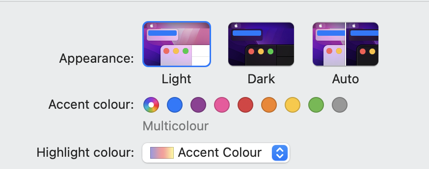
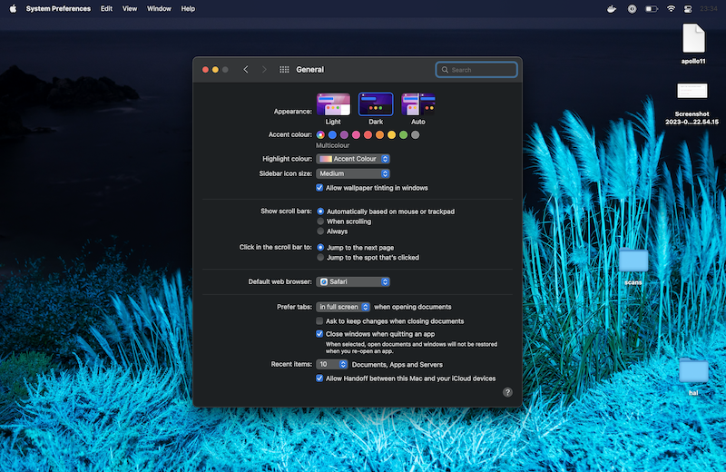
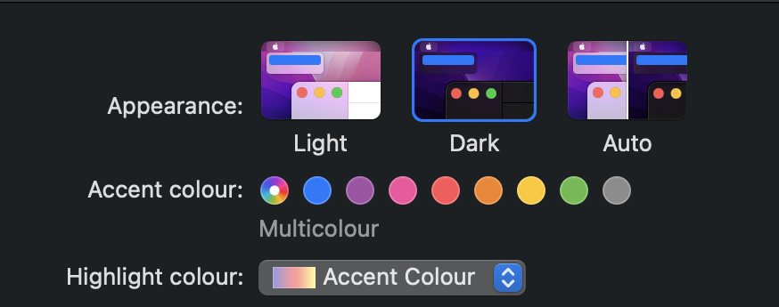
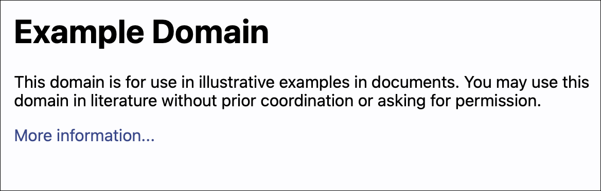
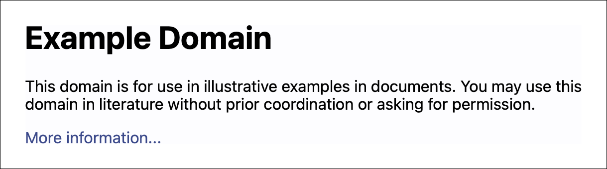

# images

These scripts are for working with images and other visual material.

## The individual scripts

<dl>
  <dt>
    <a href="https://github.com/alexwlchan/scripts/blob/main/images/copycrop">
      <code>copycrop</code>
    </a>
  </dt>
  <dd>
    this script will “copy” the crop from one image pair to another.
    
For example, suppose I have a full-screen screenshot and a crop to a small region of the screen:

    

      <table>
        <tr>
          <td></td>
          <td>&amp;</td>
          <td></td>
        </tr>
      </table>
    

    I can use this tool to extract the equivalent region from a second screenshot:
    

      <table>
        <tr>
          <td></td>
          <td>&rarr;</td>
          <td></td>
        </tr>
      </table>
    

    I often use this when making images for my website, to create identical light mode and dark mode screenshots.
  </dd>

  <dt>
    <a href="https://github.com/alexwlchan/scripts/blob/main/images/images_only_pdf">
      <code>images_only_pdf [PATH]</code>
    </a>
  </dt>
  <dd>
    take a PDF, and create a new PDF whichb just has the images filling the page.
    I use this to work around an odd behaviour of the “Scan Document” feature in Notes.app, where it adds a large white border around scanned images that I don’t want.
    
<strong>Note:</strong> this script overwrites the original file.

  </dd>

  <dt>
    <a href="https://github.com/alexwlchan/scripts/blob/main/images/pdfthumb">
      <code>pdfthumb</code>
    </a>
  </dt>
  <dd>
    get a PNG thumbnail of a specific page of a PDF, for example <code>pdfthumb pattern.pdf --page=3</code> will create a thumbnail of the third page.
  </dd>

  <dt>
    <a href="https://github.com/alexwlchan/scripts/blob/main/images/reborder">
      <code>reborder [PATH] [BORDER_WIDTH]</code>
    </a>
  </dt>
  <dd>
    replace empty space around an image with consistent white padding.
    I use this when cleaning up screenshots, to get equal padding around the entire image.
    

      <table>
        <tr>
          <td></td>
          <td>&rarr;</td>
          <td></td>
        </tr>
      </table>
    

  </dd>
</dl>
