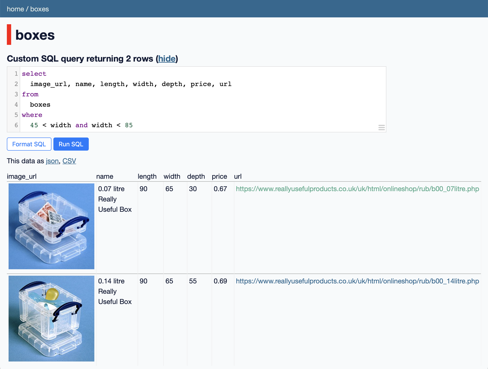

# web

These scripts are for interacting with stuff on the web.

## The individual scripts

<!-- [[[cog

# This adds the root of the repo to the PATH, which has cog_helpers.py
from os.path import abspath, dirname
import sys

sys.path.append(abspath(dirname(dirname("."))))

import cog_helpers

folder_name = "web"

scripts = [
    {
        "usage": "download_instagram.py [POST_URL]",
        "description": """
        download the photos from an Instagram post.
        """
    },
    {
        "name": "imdown",
        "description": """
        I run this when my Internet connection goes down, and it makes an audible "ping" when it comes back up.
        """
    },
    {
        "usage": 'list_liked_youtube_videos.py > liked_videos.$(date +"%Y-%m-%d").txt',
        "description": """
        print the URL of every video I've liked on YouTube.
        """
    },
    {
        "usage": "rcurl [URL]",
        "description": """
        call curl with a couple of flags that allow it to do resumable downloads, which is useful for large files.
        """
    },
    {
        "name": "save_pinboard_bookmarks.py",
        "description": """
        save a complete copy of all my Pinboard bookmarks, including my archive backups.
        """
    },
    {
        "name": "save_tumblr_likes.py",
        "description": """
        save a copy of all the posts I've liked on Tumblr to my backup drive.
        """
    },
    {
        "usage": "save_youtube_videos.py [URL...]",
        "description": """
        save a local copy of one or more YouTube videos
        """
    },
    {
        "usage": "save_safari_webarchive [URL] [OUTPUT_PATH]",
        "description": """
        save a copy of a web page as a Safari webarchive
        """
    },
    {
        "name": "scrape_really_useful_boxes.py",
        "description": """
        scrape the Really Useful Boxes product catalogue, so I can search for boxes in ways their website doesn't allow – in particular, by dimensions, so I can find boxes that fit into specific spaces.  
        """
    },
    {
        "name": "yt-dlp.py",
        "description": """
        this is a wrapper around <a href="https://github.com/yt-dlp/yt-dlp">yt-dlp</a> that does parallel downloads of videos in playlists.
        """
    },
]

cog_helpers.create_description_table(folder_name=folder_name, scripts=scripts)

]]]-->
<dl>
  <dt>
    <a href="https://github.com/alexwlchan/scripts/blob/main/web/download_instagram.py">
      <code>download_instagram.py [POST_URL]</code>
    </a>
  </dt>
  <dd>
    download the photos from an Instagram post.
  </dd>

  <dt>
    <a href="https://github.com/alexwlchan/scripts/blob/main/web/imdown">
      <code>imdown</code>
    </a>
  </dt>
  <dd>
    I run this when my Internet connection goes down, and it makes an audible "ping" when it comes back up.
  </dd>

  <dt>
    <a href="https://github.com/alexwlchan/scripts/blob/main/web/list_liked_youtube_videos.py">
      <code>list_liked_youtube_videos.py > liked_videos.$(date +"%Y-%m-%d").txt</code>
    </a>
  </dt>
  <dd>
    print the URL of every video I've liked on YouTube.
  </dd>

  <dt>
    <a href="https://github.com/alexwlchan/scripts/blob/main/web/rcurl">
      <code>rcurl [URL]</code>
    </a>
  </dt>
  <dd>
    call curl with a couple of flags that allow it to do resumable downloads, which is useful for large files.
  </dd>

  <dt>
    <a href="https://github.com/alexwlchan/scripts/blob/main/web/save_pinboard_bookmarks.py">
      <code>save_pinboard_bookmarks.py</code>
    </a>
  </dt>
  <dd>
    save a complete copy of all my Pinboard bookmarks, including my archive backups.
  </dd>

  <dt>
    <a href="https://github.com/alexwlchan/scripts/blob/main/web/save_tumblr_likes.py">
      <code>save_tumblr_likes.py</code>
    </a>
  </dt>
  <dd>
    save a copy of all the posts I've liked on Tumblr to my backup drive.
  </dd>

  <dt>
    <a href="https://github.com/alexwlchan/scripts/blob/main/web/save_youtube_videos.py">
      <code>save_youtube_videos.py [URL...]</code>
    </a>
  </dt>
  <dd>
    save a local copy of one or more YouTube videos
  </dd>

  <dt>
    <a href="https://github.com/alexwlchan/scripts/blob/main/web/save_safari_webarchive">
      <code>save_safari_webarchive [URL] [OUTPUT_PATH]</code>
    </a>
  </dt>
  <dd>
    save a copy of a web page as a Safari webarchive
  </dd>

  <dt>
    <a href="https://github.com/alexwlchan/scripts/blob/main/web/scrape_really_useful_boxes.py">
      <code>scrape_really_useful_boxes.py</code>
    </a>
  </dt>
  <dd>
    scrape the Really Useful Boxes product catalogue, so I can search for boxes in ways their website doesn't allow – in particular, by dimensions, so I can find boxes that fit into specific spaces.  
  </dd>

  <dt>
    <a href="https://github.com/alexwlchan/scripts/blob/main/web/yt-dlp.py">
      <code>yt-dlp.py</code>
    </a>
  </dt>
  <dd>
    this is a wrapper around <a href="https://github.com/yt-dlp/yt-dlp">yt-dlp</a> that does parallel downloads of videos in playlists.
  </dd>
</dl>
<!-- [[[end]]] (checksum: d5cc17500a34414cf4107db0dcc7b0e1) -->
