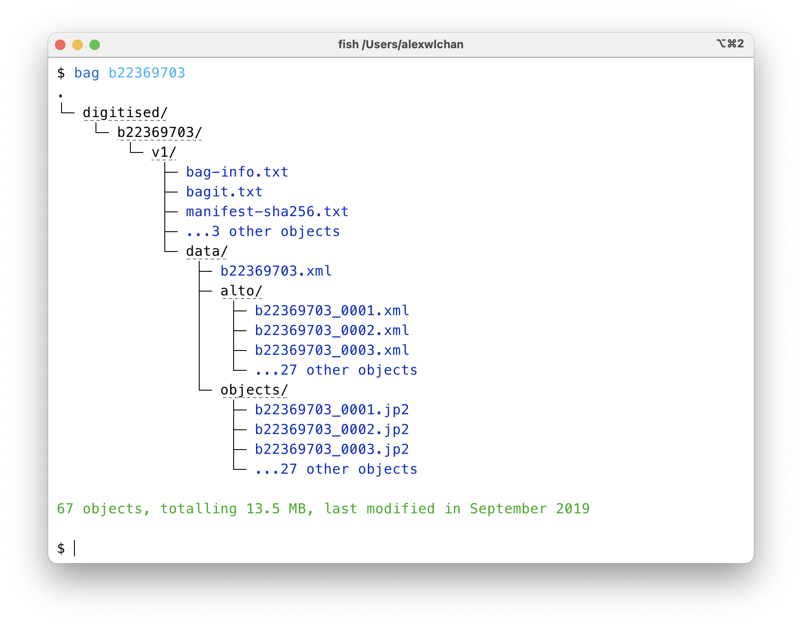

# wellcome

These are scripts that are highly specific to my work at [Wellcome Collection].
It's unlikely these would be of any use to somebody not at Wellcome (except as a learning tool).

[Wellcome Collection]: https://wellcomecollection.org/

## The individual scripts

<dl>
  <dt>
    <a href="https://github.com/alexwlchan/scripts/blob/main/wellcome/bag"><code>bag</code></a>
  </dt>
  <dd>
    prints a tree view of a bag in the <a href="https://github.com/wellcomecollection/storage-service">Wellcome storage service</a>.
    This is a thin wrapper around my <a href="https://github.com/alexwlchan/scripts/blob/main/aws/s3tree.py"><code>s3tree</code> script</a>.
    
  </dd>

  <dt>
    <a href="https://github.com/alexwlchan/scripts/blob/main/wellcome/ssh_to_archivematica"><code>ssh_to_archivematica</code></a>
  </dt>
  <dd>
    ssh into the container hosts we use to run our <a href="https://github.com/wellcomecollection/archivematica-infrastructure">Archivematica instances</a>.
  </dd>
</dl>
